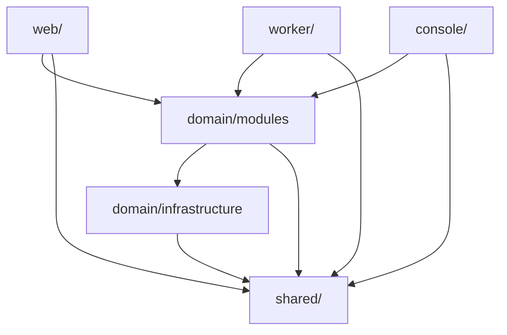
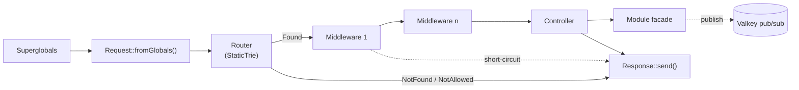

# Vwork — Vehicle Workshop Management System

A workshop management system for small-to-medium scale garages, written in plain PHP 8.5.

It is a **modular monolith** with an MVC web front end and a background worker. There is no framework and no ORM. Routing, dependency wiring and the request pipeline are hand-rolled on purpose, so the team learns how these pieces work from first principles instead of inheriting a framework's opinions.

## Contents

- [Design diagrams](#design-diagrams)
- [Architecture](#architecture)
  - [Processes](#processes)
  - [Layers and dependency rules](#layers-and-dependency-rules)
  - [The registry](#the-registry)
  - [Where services are registered](#where-services-are-registered)
  - [A request, end to end](#a-request-end-to-end)
  - [Events: web → worker](#events-web--worker)
  - [Errors](#errors)
- [Adding an endpoint](#adding-an-endpoint)
- [Adding a service](#adding-a-service)
  - [Facade (module)](#facade-module)
  - [Controller](#controller)
  - [Middleware](#middleware)
  - [Infrastructure](#infrastructure)
  - [EventHandler](#eventhandler)
- [Repository layout](#repository-layout)
- [Development](#development)
- [Tests and checks](#tests-and-checks)
- [Conventions](#conventions)

---

## Design diagrams

The draw.io sources live in `docs/`. Open them with draw.io or the VS Code draw.io extension.

| File | Covers |
| --- | --- |
| [`docs/UseCase.drawio`](docs/UseCase.drawio) | Use cases per actor, grouped by module |
| [`docs/Activity.drawio`](docs/Activity.drawio) | Activity diagram per workflow |
| [`docs/State.drawio`](docs/State.drawio) | Entity state machines |
| [`docs/EntityRelation.drawio`](docs/EntityRelation.drawio) | Database schema |
| [`docs/Class.drawio`](docs/Class.drawio) | Class design: modules, web app, worker and console, infrastructure, exception hierarchy |

The rest of this README explains how the code is put together. For what the system does, use the diagrams.

---

## Architecture

### Processes

| Process | Folder | Job | Runtime |
| --- | --- | --- | --- |
| **Web** | `web/` | The only HTTP-facing process. Request → router → middleware → controller → module facades → response. | FrankenPHP: classic mode in dev, worker mode in prod |
| **Worker** | `worker/` | Subscribes to Valkey pub/sub and runs side effects (email, SMS, notifications) off the request path. | Long-running PHP CLI |
| **Console** | `console/` | Operator commands run by hand (migrations, admin tasks). Not a standing process. | PHP CLI, executed inside the worker container |

All three sit on the same `domain/`: the **modules** hold the business logic, and the **infrastructure** talks to Postgres, Valkey, SMTP and external APIs. The three processes never depend on each other. `web/` publishes an event and `worker/` reacts to it; neither knows the other exists.

### Layers and dependency rules



| Layer | Namespace | May depend on |
| --- | --- | --- |
| Shared | `Vwork\Shared\` | nothing — no domain or HTTP knowledge |
| Infrastructure | `Vwork\Domain\Infrastructure\` | Shared |
| Modules | `Vwork\Domain\Modules\` | Infrastructure, Shared |
| Web / Worker / Console | `Vwork\Web\`, `Vwork\Worker\`, `Vwork\Console\` | Modules, Shared |

`IDomainRegistry` / `DomainRegistry` sit in `Vwork\Domain\` (`domain/src/`). They are the seam every process reaches the domain through.

Three tools enforce this:

- **Deptrac** (`.tools/deptrac.php`) enforces the layer table above.
- **PHPat** (`test/Architecture/`) enforces what Deptrac can't express:
  - `ModuleRules.php`: which modules may use which, and facade and `Internal/` privacy.
  - `InfrastructureRules.php`: concrete infrastructure classes and `Internal/` are private.
  - `WebRules.php`: controllers and middleware are private to configuration, the composition root is invisible to subfolders, and the subfolder dependency ladder.
- **PHPStan** runs at level `max`.

The web subfolder ladder (`WebRules.php`) — each folder may only depend on the folders to its right:

```text
Http/        → nothing
Utils/       → nothing            (Http and Utils may not touch each other)
Controllers/ → Http, Utils
Middleware/  → Http, Utils        (Controllers and Middleware are peers)
Pipeline/    → Controllers, Middleware, Http, Utils
Router/      → Pipeline, Controllers, Middleware, Http, Utils
```

The files directly in `Vwork\Web\` form the composition root (`AppBuilder`, `AppServiceRegistry`, …). They wire the subfolders, and no subfolder may reference them.

### The registry

Every process builds **one registry** at boot. Every facade, infrastructure object, controller, middleware and event handler is resolved through it, and each is built **at most once per process**. This is how the codebase gets shared single instances without `getInstance()` or private constructors.

`Vwork\Shared\Collections\Registry` holds bindings grouped by **category**:

```php
array<class-string $category, array<string $key, Closure(registry): object>>
```

- **Lazy:** nothing is built up front. The first lookup of a key runs its closure, caches the result, and returns it. Every later lookup returns the same instance, and unused services cost nothing.
- **Self-resolving:** each closure receives the registry, so it pulls its own dependencies back out of it. This is constructor injection with no autowiring.
- **Fails loudly:** a missing binding throws `VworkError` naming the key, at the point of use. An unknown category fails when the registry is constructed.

| Registry | Categories | Lookups |
| --- | --- | --- |
| `DomainRegistry` (`IDomainRegistry`) | `IInfrastructure`, `IFacade` | `getInfrastructure()`, `getFacade()` |
| `AppServiceRegistry` (web) | + `IController`, `IMiddleware` | + `getController()`, `getMiddleware()` |
| `WorkerServiceRegistry` (worker) | + event handlers, keyed by `PubSubTopics` | + `getEventHandler()` |
| `ConsoleServiceRegistry` (console) | + command handlers | + `getCommandHandler()` |

Because instances live for the whole process (FrankenPHP worker mode keeps the web app in memory across requests), **services must be stateless**. Never keep per-request data on a facade, controller or middleware; pass it through arguments and pipeline attributes.

### Where services are registered

Bindings are plain PHP files under each process's `config/`. Each file `return`s a map of key → closure. They have no namespace; they are `require`d, not autoloaded.

| Process | File | Category | Keyed by |
| --- | --- | --- | --- |
| web | `web/config/services/infrastructure.php` | `IInfrastructure` | interface |
| web | `web/config/services/modules.php` | `IFacade` | interface |
| web | `web/config/services/middleware.php` | `IMiddleware` | concrete class |
| web | `web/config/services/controllers.php` | `IController` | concrete class |
| web | `web/config/routes/*.php` | routes (read by `AppBuilder`) | — |
| worker | `worker/config/services/infrastructure.php` | `IInfrastructure` | interface |
| worker | `worker/config/services/modules.php` | `IFacade` | interface |
| worker | `worker/config/services/eventHandlers.php` | event handlers | `PubSubTopics` value |
| console | `console/config/services/infrastructure.php` | `IInfrastructure` | interface |
| console | `console/config/services/modules.php` | `IFacade` | interface |
| console | `console/config/services/commands.php` | command handlers | command name |

**Each process has its own complete set of bindings.** A facade used by both web and worker is registered in both `modules.php` files; no process assumes another's bindings cover what it needs.

Facades and infrastructure are keyed by **interface**, because their consumers only ever know the interface. Controllers and middleware are keyed by **concrete class**. They are the end of the line: only route configuration names them, and nothing else depends on them.

### A request, end to end



**At boot, once per process:**

1. `AppBuilder` loads the service files and route files listed above.
2. For each route, `PipelineFactory` resolves the route's middleware and controller from the registry. It wraps them into a nested chain of `IPipelineHandler`s — `MiddlewareHandler` → … → `ControllerHandler` — and stores the chain at the route's leaf in the router's `StaticTrie`.
3. `AppBuilder` builds the `IApp`. The app object is callable, so it is handed straight to FrankenPHP's worker loop.

**For each request:**

1. `Request::fromGlobals()` reads `$_SERVER`, `$_GET`, `$_POST`, `$_FILES` and `php://input` once. **No other code reads superglobals.**
2. The router matches the method and path and returns a `RouteMatch`: `Found` with the handler chain and path params, or `NotFound` / `NotAllowed`.
3. The chain runs. Each middleware receives the request, the **attributes** array (path params plus whatever earlier middleware added), the route's `RouteContext`, and `$next`. It either returns its own `Response` (short-circuit) or calls `$next->handle(...)`.
4. The controller reads the request and attributes, calls module facades, and returns a `Response`.
5. `Response::send()` writes the status, headers and body. The body is written by a closure, so a page, a file download and an SSE stream all go out through the same call.

### Events: web → worker

Anything slow or external (email, SMS) is taken off the request path:

1. A facade publishes a `PubSubTopics` case with a JSON payload through `IPubSub`.
2. The worker is subscribed to every topic that has a registered handler.
3. It dispatches each message to that topic's `IEventHandler`.
4. The handler calls a module facade — the same facades the web app uses.

Topics are the `PubSubTopics` enum (`domain/infrastructure/src/PubSub/PubSubTopics.php`); values are `<entity>.<event>`, e.g. `job.updated`.

### Errors

There are two roots, in `shared/src/Exception/`:

- **`VworkError`** (extends `\Error`): the code or configuration is wrong. Don't catch it and handle it; fix the code. Only the top-level boundary catches it, to log it and return a generic 500.
- **`VworkException`** (extends `\Exception`): the world didn't cooperate — a failed validation, a missing record, a declined payment. Correct code throws these routinely, and callers catch them.

Each area has its own subclass pair, so callers can catch one area in one sweep: `InfrastructureError` / `InfrastructureException`, `WebError` / `WebException`, and so on. The full hierarchy is in `docs/Class.drawio`.

---

## Adding an endpoint

This example adds `POST /staff/jobs/{id}/ready-for-qa`, which lets a technician mark their job ready for QA. It touches four places:

| # | What | Where |
| --- | --- | --- |
| 1 | Facade method | `domain/modules/src/Job/` |
| 2 | Controller action | `web/src/Controllers/JobController.php` |
| 3 | Route | `web/config/routes/staff.php` |
| 4 | Bindings (only for classes that are new) | `web/config/services/*.php` |

**1. Facade method.** Add the use case to the module's interface and implement it. See [Facade](#facade-module).

```php
// domain/modules/src/Job/IJobFacade.php
public function markReadyForQa(int $jobId, int $technicianId): Job;
```

**2. Controller action.** Every action has the same signature: it receives the `Request` and the pipeline attributes and returns a `Response`. See [Controller](#controller).

```php
// web/src/Controllers/JobController.php
public function markReadyForQa(Request $request, array $attributes): Response
```

**3. Route.** A route file returns a list of route configs:

```php
<?php
// web/config/routes/staff.php

declare(strict_types=1);

use Vwork\Domain\Modules\Identity\UserRoles;
use Vwork\Web\Controllers\JobController;
use Vwork\Web\Http\HttpMethods;
use Vwork\Web\Middleware\AuthMiddleware;
use Vwork\Web\Middleware\CsrfMiddleware;
use Vwork\Web\Middleware\RbacMiddleware;

return [
    [
        'method'     => HttpMethods::POST,
        'path'       => '/staff/jobs/{id}/ready-for-qa',
        'controller' => ['class' => JobController::class, 'method' => 'markReadyForQa'],
        'middleware' => [AuthMiddleware::class, RbacMiddleware::class, CsrfMiddleware::class],
        'context'    => ['roles' => [UserRoles::Technician]],
    ],
];
```

| Key | Meaning |
| --- | --- |
| `path` | `{name}` segments arrive in the attributes as strings: `$attributes['id']`. |
| `middleware` | Runs **in list order**; the first entry is the outermost. Put authentication first, since later middleware reads what it writes. |
| `context` | Becomes the route's `RouteContext`: allowed roles, validation rules. Middleware reads it; controllers don't. |

**4. Bindings.** If the controller, a middleware or the facade is new, register it. See each service's section below. A new action on an existing controller needs no binding change.

**Then run the checks:**

```bash
vendor/bin/phpunit --configuration=.tools/phpunit.xml.dist --testsuite=unit
vendor/bin/phpstan analyse --configuration=.tools/phpstan.neon
vendor/bin/deptrac analyse --config-file=.tools/deptrac.php
vendor/bin/phpstan analyse --configuration=.tools/phpat.neon
```

---

## Adding a service

Every service follows the same three steps:

1. Write an interface.
2. Write a `final` implementation.
3. Bind it in the right `config/` file.

Only the location and the key change between types.

| Service | Interface lives in | Implementation lives in | Bound in | Key |
| --- | --- | --- | --- | --- |
| Facade | `domain/modules/src/<Module>/I<Module>Facade.php` | `domain/modules/src/<Module>/<Module>Facade.php` | `<process>/config/services/modules.php` | interface |
| Controller | — (extends `Controller`) | `web/src/Controllers/` | `web/config/services/controllers.php` | class |
| Middleware | — (implements `IMiddleware`) | `web/src/Middleware/` | `web/config/services/middleware.php` | class |
| Infrastructure | `domain/infrastructure/src/<Area>/I<Thing>.php` | `domain/infrastructure/src/<Area>/` | `<process>/config/services/infrastructure.php` | interface |
| EventHandler | — (implements `IEventHandler`) | `worker/src/EventHandlers/` | `worker/config/services/eventHandlers.php` | `PubSubTopics` value |

### Facade (module)

A module is a folder under `domain/modules/src/`. Its facade is the **only** thing anything outside the module may use.

```text
domain/modules/src/Job/
├── IJobFacade.php        # public contract — extends IFacade
├── JobFacade.php         # final implementation — only config references it
├── Entity/               # readonly value objects returned by the facade
│   ├── Job.php
│   └── JobStatus.php
└── Internal/             # private to the module: repositories, services
    └── JobRepository.php
```

**Interface:**

```php
<?php

declare(strict_types=1);

namespace Vwork\Domain\Modules\Job;

use Vwork\Domain\Modules\IFacade;
use Vwork\Domain\Modules\Job\Entity\Job;
use Vwork\Domain\Modules\ModuleException;

interface IJobFacade extends IFacade
{
    /**
     * @throws ModuleException if the job doesn't exist or isn't assigned to this technician
     */
    public function markReadyForQa(int $jobId, int $technicianId): Job;
}
```

**Entity** (readonly, no behaviour that reaches `Internal/`):

```php
<?php

declare(strict_types=1);

namespace Vwork\Domain\Modules\Job\Entity;

final readonly class Job
{
    public function __construct(
        public int $id,
        public int $technicianId,
        public JobStatus $status,
    ) {
    }
}
```

**Implementation.** Dependencies arrive through the constructor, as interfaces:

```php
<?php

declare(strict_types=1);

namespace Vwork\Domain\Modules\Job;

use Override;
use Vwork\Domain\Infrastructure\Database\IDatabase;
use Vwork\Domain\Infrastructure\PubSub\IPubSub;
use Vwork\Domain\Infrastructure\PubSub\PubSubTopics;
use Vwork\Domain\Modules\Job\Entity\Job;
use Vwork\Domain\Modules\Job\Entity\JobStatus;
use Vwork\Domain\Modules\Job\Internal\JobRepository;
use Vwork\Domain\Modules\ModuleException;

final class JobFacade implements IJobFacade
{
    private readonly JobRepository $jobs;

    public function __construct(
        IDatabase $db,
        private readonly IPubSub $pubsub,
    ) {
        $this->jobs = new JobRepository($db);
    }

    #[Override]
    public function markReadyForQa(int $jobId, int $technicianId): Job
    {
        $job = $this->jobs->find($jobId)
            ?? throw new ModuleException("Job {$jobId} not found", self::class);

        if ($job->technicianId !== $technicianId) {
            throw new ModuleException("Job {$jobId} is not assigned to technician {$technicianId}", self::class);
        }

        $updated = $this->jobs->setStatus($jobId, JobStatus::QA);

        $this->pubsub->publish(
            PubSubTopics::JobUpdated,
            json_encode(['jobId' => $jobId, 'status' => $updated->status->value], JSON_THROW_ON_ERROR),
        );

        return $updated;
    }
}
```

`Internal/JobRepository` holds the SQL, uses `IDatabase::query()` for reads and `IDatabase::execute()` for anything that must be atomic, and maps rows to entities.

**Binding**, in every process that uses the facade:

```php
<?php
// web/config/services/modules.php  (and worker/…, console/… where needed)

declare(strict_types=1);

use Vwork\Domain\IDomainRegistry;
use Vwork\Domain\Infrastructure\Database\IDatabase;
use Vwork\Domain\Infrastructure\PubSub\IPubSub;
use Vwork\Domain\Modules\Job\IJobFacade;
use Vwork\Domain\Modules\Job\JobFacade;

return [
    IJobFacade::class => fn (IDomainRegistry $r) => new JobFacade(
        db: $r->getInfrastructure(IDatabase::class),
        pubsub: $r->getInfrastructure(IPubSub::class),
    ),
];
```

**For a new module**, also add it to `$moduleDeps` in `test/Architecture/ModuleRules.php` with the modules it is allowed to use. A module can only use another module's facade interface, and only if it is listed there. It receives that facade through its constructor exactly like infrastructure: `$r->getFacade(IStaffFacade::class)`.

**Rules PHPat checks for modules:**
- `I<Name>Facade` extends `IFacade`, and `<Name>Facade` implements it.
- No namespaced code references `<Name>Facade`; only config does.
- `Entity/` and `Internal/` never use the module's own facade.
- Entities are `readonly` and don't depend on `Internal/`.
- Nothing outside the module touches its `Internal/`.

### Controller

A controller is thin. It reads input, calls facades, and turns the result (or an expected failure) into a `Response`. It never touches the database, cache or pub/sub directly.

```php
<?php

declare(strict_types=1);

namespace Vwork\Web\Controllers;

use Vwork\Domain\Modules\Job\IJobFacade;
use Vwork\Domain\Modules\ModuleException;
use Vwork\Shared\Types\Cast;
use Vwork\Web\Http\HttpStatus;
use Vwork\Web\Http\Request;
use Vwork\Web\Http\Response;

final class JobController extends Controller
{
    public function __construct(
        private readonly IJobFacade $jobs,
    ) {
    }

    /**
     * POST /staff/jobs/{id}/ready-for-qa
     *
     * @param array<string, mixed> $attributes
     */
    public function markReadyForQa(Request $request, array $attributes): Response
    {
        $userId = $attributes['userId'];   // written by AuthMiddleware
        assert(is_int($userId));

        try {
            $job = $this->jobs->markReadyForQa(
                jobId: (int) Cast::string($attributes['id']),   // path param
                technicianId: $userId,
            );
        } catch (ModuleException $e) {
            return Response::error(HttpStatus::Conflict, $e->getMessage());
        }

        return $this->view('staff/jobs/show', ['job' => $job]);
    }
}
```

**Responses.** `Controller` provides `view()` (render a template), `payload()` (data), `sse()` (a server-sent-events message) and `file()` (a download). `Response`'s named constructors cover the rest: `redirect`, `noContent`, `error`, `html`, `text`, `stream`.

**Binding:**

```php
<?php
// web/config/services/controllers.php

declare(strict_types=1);

use Vwork\Domain\IDomainRegistry;
use Vwork\Domain\Modules\Job\IJobFacade;
use Vwork\Web\Controllers\JobController;

return [
    JobController::class => fn (IDomainRegistry $r) => new JobController(
        jobs: $r->getFacade(IJobFacade::class),
    ),
];
```

**Rules:**
- The class is `final`, in `Vwork\Web\Controllers\`, and extends `Controller`.
- It may use `Http/`, `Utils/` and module facade interfaces — never `Middleware/`, `Pipeline/`, `Router/` or the composition root.
- Only config references it.
- The controller is built once and serves every request, so keep it stateless.

### Middleware

Middleware sits between the router and the controller. Each one either **short-circuits** with its own `Response` or **passes on** by calling `$next`, optionally adding attributes for the handlers after it.

```php
<?php

declare(strict_types=1);

namespace Vwork\Web\Middleware;

use Override;
use Vwork\Domain\Modules\Identity\IIdentityFacade;
use Vwork\Web\Http\HttpCookies;
use Vwork\Web\Http\Request;
use Vwork\Web\Http\Response;
use Vwork\Web\Pipeline\IPipelineHandler;
use Vwork\Web\Router\RouteContext;

final class AuthMiddleware implements IMiddleware
{
    public function __construct(
        private readonly IIdentityFacade $identity,
    ) {
    }

    /**
     * @param array<string, mixed> $attributes
     */
    #[Override]
    public function handle(Request $request, array $attributes, IPipelineHandler $next, RouteContext $context): Response
    {
        $token = $request->cookies[HttpCookies::SessionToken->value] ?? null;
        $session = $token === null ? null : $this->identity->findSession($token);

        if ($session === null) {
            return Response::redirect('/login');          // short-circuit
        }

        return $next->handle($request, [                  // pass on, with more attributes
            ...$attributes,
            'userId' => $session->userId,
            'role'   => $session->role,
        ]);
    }
}
```

**Binding:**

```php
<?php
// web/config/services/middleware.php

declare(strict_types=1);

use Vwork\Domain\IDomainRegistry;
use Vwork\Domain\Modules\Identity\IIdentityFacade;
use Vwork\Web\Middleware\AuthMiddleware;

return [
    AuthMiddleware::class => fn (IDomainRegistry $r) => new AuthMiddleware(
        identity: $r->getFacade(IIdentityFacade::class),
    ),
];
```

Then add it to the `middleware` list of each route that needs it. **Order matters** — see [Adding an endpoint](#adding-an-endpoint).

**Rules:**
- The class is `final`, in `Vwork\Web\Middleware\`, and implements `IMiddleware`.
- Only config references it.
- **Attributes are the only way to hand data to later handlers.** The middleware instance is shared across all requests, so never store per-request state on it.
- Route-specific settings (roles, validation rules) come from `$context`; don't hard-code them in the middleware.

### Infrastructure

Infrastructure is anything that talks to the outside world. Modules see only the interface.

**1. Interface.** Put it in its own area folder and extend `IInfrastructure`. If the area already has an interface (`ICache`, `IEmailServer`, …), implement that instead.

```php
<?php

declare(strict_types=1);

namespace Vwork\Domain\Infrastructure\VinDecoder;

use Vwork\Domain\Infrastructure\IInfrastructure;
use Vwork\Domain\Infrastructure\InfrastructureException;

interface IVinDecoder extends IInfrastructure
{
    /**
     * @return array<string, mixed> decoded fields; empty if the source has no match
     * @throws InfrastructureException if the source can't be reached or answers badly
     */
    public function decode(string $vin): array;
}
```

**2. Implementation.** Write a `final` class. Configuration comes in through the constructor, and `connect()` opens or reopens whatever connection it holds.

```php
<?php

declare(strict_types=1);

namespace Vwork\Domain\Infrastructure\VinDecoder;

use JsonException;
use Override;
use Vwork\Domain\Infrastructure\InfrastructureException;

final class HttpVinDecoder implements IVinDecoder
{
    public function __construct(
        private readonly string $baseUrl,
    ) {
    }

    #[Override]
    public function connect(): void
    {
        // Stateless HTTP: nothing to open. Stateful clients (PDO, Redis)
        // open their connection here, and callers use it to reconnect.
    }

    #[Override]
    public function decode(string $vin): array
    {
        $body = file_get_contents("{$this->baseUrl}/{$vin}");
        if ($body === false) {
            throw new InfrastructureException("VIN lookup failed for {$vin}", self::class);
        }

        try {
            $data = json_decode($body, true, flags: JSON_THROW_ON_ERROR);
        } catch (JsonException $e) {
            throw new InfrastructureException("VIN lookup returned invalid JSON for {$vin}", self::class, $e);
        }

        if (!is_array($data)) {
            throw new InfrastructureException("VIN lookup returned an unexpected shape for {$vin}", self::class);
        }

        /** @var array<string, mixed> $data */
        return $data;
    }
}
```

**3. Binding**, in every process that needs it. Read configuration from the environment with `Cast` so a missing variable fails loudly:

```php
<?php
// web/config/services/infrastructure.php  (and worker/…, console/… where needed)

declare(strict_types=1);

use Vwork\Domain\Infrastructure\VinDecoder\HttpVinDecoder;
use Vwork\Domain\Infrastructure\VinDecoder\IVinDecoder;
use Vwork\Shared\Types\Cast;

return [
    IVinDecoder::class => fn () => new HttpVinDecoder(
        baseUrl: Cast::string(getenv('VIN_DECODER_URL')),
    ),
];
```

Add any new environment variable to the relevant services in `.docker/docker-compose.yml`. If it has a dev default, add that to `.docker/.env`.

**Rules:**
- **Error or exception:**
  - `InfrastructureError`: the adapter can't work at all — unreachable after retries, bad credentials, bad configuration.
  - `InfrastructureException`: a single operation failed at runtime and the caller may recover.
  - Both take `self::class` as the second argument.
- **Shared plumbing goes in `Internal/`.** Code shared by several adapters (as `Internal\Valkey` is for `ValkeyCache` and `ValkeyPubSub`) goes there. PHPat forbids anything outside infrastructure from using it.
- **Consumers depend on the interface only.** Only config names the concrete class.
- **Infrastructure depends on nothing but `shared/`.** It has no module knowledge.

### EventHandler

An event handler is the worker's equivalent of a controller. It receives one pub/sub message, then calls module facades.

**1. Topic.** Use an existing `PubSubTopics` case, or add one:

```php
// domain/infrastructure/src/PubSub/PubSubTopics.php
case JobUpdated = 'job.updated';
```

**2. Publisher.** The facade that owns the change publishes it (see `JobFacade` above). Keep the payload to IDs and the new state; the handler reads anything else through a facade.

**3. Handler:**

```php
<?php

declare(strict_types=1);

namespace Vwork\Worker\EventHandlers;

use JsonException;
use Override;
use Vwork\Domain\Infrastructure\Logging\ILogger;
use Vwork\Domain\Modules\ModuleException;
use Vwork\Domain\Modules\Notification\INotificationFacade;

final class JobUpdatedHandler implements IEventHandler
{
    public function __construct(
        private readonly INotificationFacade $notifications,
        private readonly ILogger $logger,
    ) {
    }

    #[Override]
    public function handle(string $event): void
    {
        try {
            $payload = json_decode($event, true, flags: JSON_THROW_ON_ERROR);
            if (!is_array($payload) || !is_int($payload['jobId'] ?? null)) {
                $this->logger->warning('Malformed job.updated event', ['event' => $event]);
                return;
            }

            $this->notifications->notifyJobStatus(jobId: $payload['jobId']);
        } catch (JsonException | ModuleException $e) {
            $this->logger->error($e->getMessage(), ['event' => $event]);
        }
    }
}
```

**4. Binding**, keyed by the topic's value:

```php
<?php
// worker/config/services/eventHandlers.php

declare(strict_types=1);

use Vwork\Domain\IDomainRegistry;
use Vwork\Domain\Infrastructure\Logging\ILogger;
use Vwork\Domain\Infrastructure\PubSub\PubSubTopics;
use Vwork\Domain\Modules\Notification\INotificationFacade;
use Vwork\Worker\EventHandlers\JobUpdatedHandler;

return [
    PubSubTopics::JobUpdated->value => fn (IDomainRegistry $r) => new JobUpdatedHandler(
        notifications: $r->getFacade(INotificationFacade::class),
        logger: $r->getInfrastructure(ILogger::class),
    ),
];
```

The facades and infrastructure the handler uses must also be bound in `worker/config/services/modules.php` and `infrastructure.php`.

**Rules:**
- **Handle expected failures inside `handle()`.** The handler runs inside `IPubSub::subscribe()`, which blocks, so an uncaught throwable ends the subscription and stops the worker. Catch expected failures (`VworkException`, bad payloads) and log them.
- **Let `VworkError` propagate.** A crashed worker is the loud signal that code or configuration is broken.
- **Each topic has one handler.** A topic with no registered handler is simply not subscribed to.
- **No HTTP here.** Handlers never reference `web/`.

---

## Repository layout

```text
.
├── composer.json              # one Composer project; PSR-4 root per folder
├── package.json               # Bun workspace root (workspaces: ["web"])
├── .docker/                   # compose stacks (prod / test / dev) + dev-only .env
├── .devcontainer/             # attaches VS Code to the `test` service
├── .githooks/                 # pre-commit (PSR-12), pre-push (static analysis)
├── .tools/                    # deptrac, phpstan, phpat, phpunit, php-cs-fixer configs
├── .vscode/                   # tasks: lint, test, analyse, docker, assets
├── docs/                      # design diagrams (draw.io)
│
├── shared/                    # Vwork\Shared\ — Registry, StaticTrie, Cast, VworkError/Exception
│   ├── src/
│   └── test/
│
├── domain/
│   ├── src/                   # Vwork\Domain\ — IDomainRegistry, DomainRegistry
│   ├── test/                  # integration: facades against real Postgres + Valkey
│   ├── infrastructure/
│   │   ├── src/               # Vwork\Domain\Infrastructure\ — one folder per area
│   │   │   ├── Cache/  Database/  Email/  Logger/  Notification/  PubSub/
│   │   │   └── Internal/      # shared adapter plumbing, private to infrastructure
│   │   └── test/
│   └── modules/
│       ├── src/               # Vwork\Domain\Modules\ — IFacade + one folder per module
│       └── test/
│
├── web/                       # Vwork\Web\
│   ├── Dockerfile             # stages: bun, base, dev, assets, test, prod
│   ├── dev.start.sh           # dev: Bun asset watcher + frankenphp --watch
│   ├── config/
│   │   ├── Caddyfile.dev / Caddyfile.prod
│   │   ├── routes/            # route configs
│   │   └── services/          # infrastructure, modules, middleware, controllers
│   ├── public/                # document root; index.php
│   ├── resources/             # ts/, scss/, build.config.ts → public/assets/
│   ├── src/
│   │   ├── (root)             # composition root: AppBuilder, AppServiceRegistry, …
│   │   ├── Http/              # Request, Response, HttpMessage, UploadedFile, enums
│   │   ├── Utils/             # Csrf, View
│   │   ├── Controllers/
│   │   ├── Middleware/
│   │   ├── Pipeline/
│   │   └── Router/
│   └── test/                  # Unit/, Integration/, e2e/ (Playwright)
│
├── worker/                    # Vwork\Worker\
│   ├── Dockerfile             # console/ runs from this image too
│   ├── main.php
│   ├── config/services/       # infrastructure, modules, eventHandlers
│   ├── src/                   # Worker, WorkerServiceRegistry, EventHandlers/
│   └── test/
│
├── console/                   # Vwork\Console\
│   ├── main.php
│   ├── config/services/       # infrastructure, modules, commands
│   ├── src/
│   └── test/
│
└── test/
    └── Architecture/          # PHPat rules
```

---

## Development

### Stack

| | |
| --- | --- |
| PHP | 8.5 — FrankenPHP 1.12.7 image (`web`), `php:8.5.9-cli` (`worker`) |
| Extensions | `pdo_pgsql`, `redis` 6.3.0, `opcache`, `gd`, `iconv`; Xdebug in dev only |
| Database | PostgreSQL 16.14 |
| Cache / pub-sub | Valkey 9.1.1 |
| Frontend | Bun 1.3, TypeScript 5.6, Sass |
| Testing | PHPUnit 13.3, Playwright 1.62.1 |
| Static analysis | PHPStan 2.2 (level `max`), Deptrac 4.7, PHPat 0.12.4, PHP-CS-Fixer 3.95 (PSR-12) |

### Devcontainer

Open the repo in VS Code and choose **Reopen in Container**.

- **Stack:** it starts `.docker/docker-compose.dev.yml`.
- **Attached service:** VS Code attaches to the `test` service (PHP 8.5, Composer, Bun and Playwright, at `/app`).
- **Git hooks:** enabled automatically.
- **Ports:** `web:80` and Xdebug's 9003 are forwarded.

### Running the stack

The compose files are in `.docker/`, so pass them with `-f`:

```bash
docker compose -f .docker/docker-compose.dev.yml up      # web, worker, db, cache, test
docker compose -f .docker/docker-compose.dev.yml down

# console commands run inside the worker container
docker compose -f .docker/docker-compose.dev.yml exec worker php console/main.php <command>
```

The web app is served on <http://localhost>.

| Compose file | Adds |
| --- | --- |
| `docker-compose.yml` | Prod stack: `web` (80 / 443), `worker`, `db`, `cache`. `web_net` is public; `data_net` connects web and worker to db and cache. |
| `docker-compose.test.yml` | The `test` container. It reaches `web` as `web.local` on `test_net`, and db / cache directly on `data_net`. |
| `docker-compose.dev.yml` | `dev` build targets and source bind mounts. |

### Environment

| Variable | Used by |
| --- | --- |
| `DB_HOST`, `DB_PORT`, `DB_NAME`, `DB_USER`, `DB_PASSWORD` | web, worker, integration tests |
| `CACHE_HOST`, `CACHE_PORT`, `CACHE_PASSWORD` | web, worker, integration tests |
| `CSRF_KEY` | `Csrf`: HMAC key for CSRF tokens |
| `VIEW_PATH` | `View`: templates directory, relative to the repo root |
| `BASE_URL` | Playwright |
| `SERVER_NAME` | `Caddyfile.prod`. Set it to get automatic Let's Encrypt HTTPS; leave it unset behind a TLS-terminating proxy. |

`.docker/.env` holds **dev-only placeholders** and is committed on purpose. Deploy with real secrets:

```bash
docker compose -f .docker/docker-compose.yml --env-file /path/to/prod.env up -d --build
```

### Frontend assets

```bash
bun install          # from the repo root; one hoisted node_modules/
bun run build        # → web/public/assets/
bun run dev          # watch and rebuild
bun run typecheck
```

---

## Tests and checks

```bash
vendor/bin/phpunit --configuration=.tools/phpunit.xml.dist --testsuite=unit
vendor/bin/phpunit --configuration=.tools/phpunit.xml.dist --testsuite=integration   # needs db + cache
bun run test:e2e

vendor/bin/phpstan analyse --configuration=.tools/phpstan.neon      # types, level max
vendor/bin/deptrac analyse --config-file=.tools/deptrac.php         # layers
vendor/bin/phpstan analyse --configuration=.tools/phpat.neon        # architecture rules
vendor/bin/php-cs-fixer fix --config=.tools/.php-cs-fixer.dist.php --dry-run --diff
```

| Suite | Lives in | Touches |
| --- | --- | --- |
| Unit | each folder's `test/` (`test/Unit/` in web, worker, console) | nothing external; everything faked |
| Integration | `domain/test/`, `{web,worker,console}/test/Integration/` | real Postgres / Valkey |
| End-to-end | `web/test/e2e/` | browser → web → database |
| Architecture | `test/Architecture/` | static analysis of the whole codebase |

If a unit test needs the database, it's an integration test.

The same commands are VS Code tasks (**Run Task** → `Lint:`, `Test:`, `Static Analyse:`, `Assets:`, `Docker:`, `Check: all`).

**Git hooks** (`git config core.hooksPath .githooks`, done automatically in the devcontainer):
- **pre-commit:** PSR-12 dry-run on staged PHP files.
- **pre-push:** PHPStan, Deptrac, PHPat.

---

## Conventions

- `declare(strict_types=1);` in every PHP file.
- PSR-12 for PHP (4-space indent); 3 spaces for everything else (see `.editorconfig`).
- `final` on every concrete class unless it is designed to be extended.
- Depend on interfaces. Concrete facades and infrastructure classes, controllers and middleware are named only in `config/`.
- Read superglobals only in `Request::fromGlobals()`.
- Read environment variables only in `config/` files and through `Cast`. The exceptions are `Csrf` and `View`, which read `CSRF_KEY` and `VIEW_PATH` themselves.
- `VworkError` for broken code or configuration, `VworkException` for expected runtime failures.
- No per-request state on any service.
