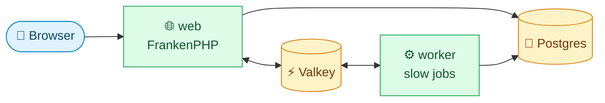
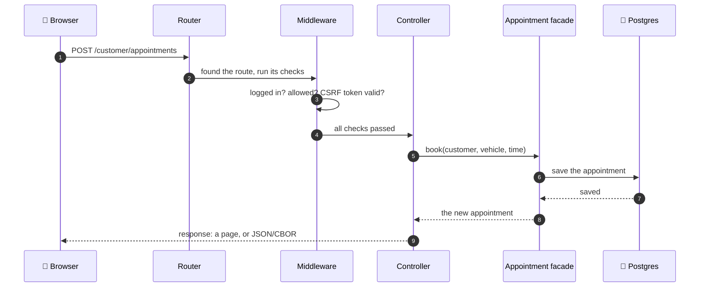
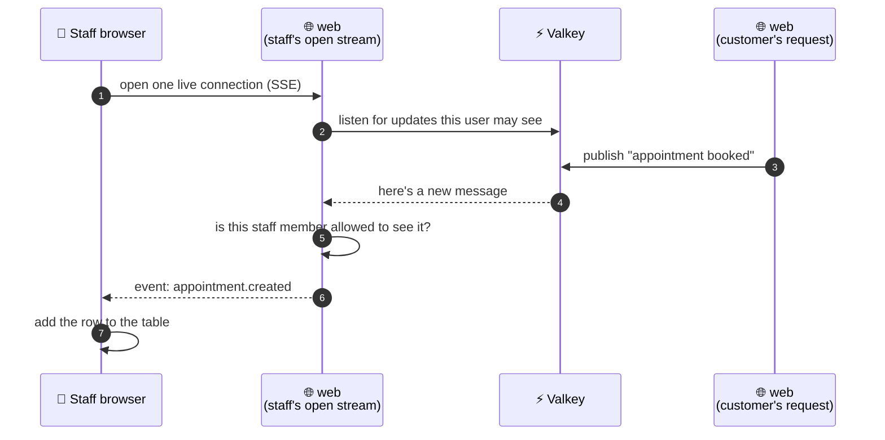
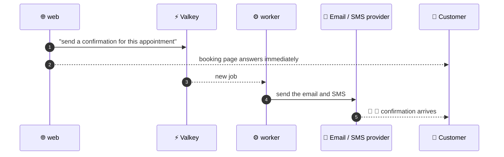
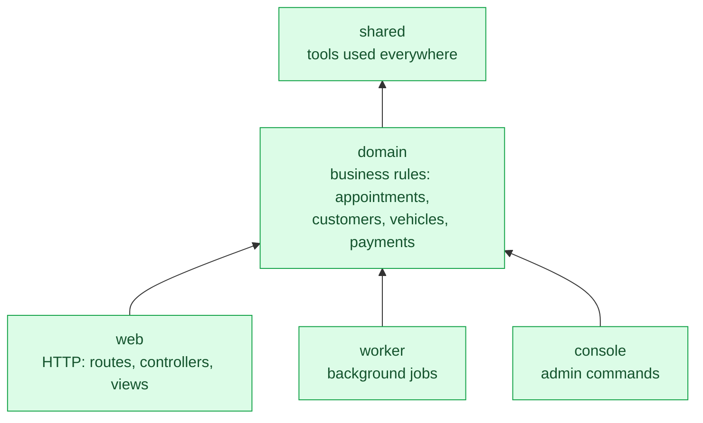
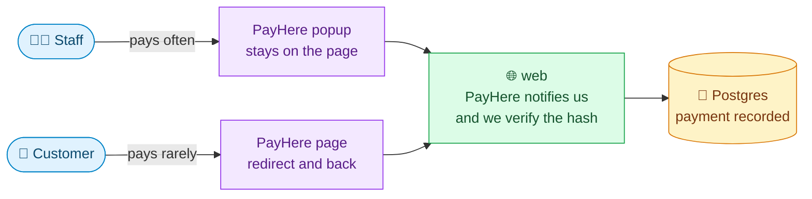

# How vwork works

This page follows one real moment through the whole system: **a customer books an appointment, and a staff member sees it appear on their screen a second later.** Every part of vwork plays a role in that moment, so by the end you'll know what each part does and why it exists.

Each chapter has the same shape: a short explanation, one diagram, and where to find it in the code.

> **Colour key used in every diagram:** 🔵 people and browsers · 🟢 our code · 🟡 data stores

---

## 1. The big picture

vwork runs as four containers. Browsers only ever talk to **web**. Everything else sits behind it.

- **web** answers every HTTP request, and keeps live connections open to push updates.
- **worker** does the slow jobs, like sending emails and SMS, so nobody waits for them.
- **Postgres** stores everything that must survive a restart.
- **Valkey** carries messages between the other parts.

web and worker never call each other directly. They share the database, and they pass messages through Valkey.

There's no separate container for **console**: its commands (migrations, admin tasks) run inside the worker container.

📂 **In the code:** `web/`, `worker/`, `console/`, `.docker/docker-compose.yml`

---

## 2. A request arrives

The customer fills in the booking form and presses **Book**. Here's the journey that request takes inside web.

1. The **Router** reads the URL and method, and decides which controller should handle it.
2. The **Middleware** runs the checks every protected request needs: *is someone logged in* (Auth), *are they allowed to do this* (RBAC), *did the form really come from our site* (CSRF).
3. The **Controller** does very little on purpose: it reads the request, calls a facade, and turns the result into a response.
4. The **Facade** is where the business rules live. It's the only thing that talks to the database.

A controller answers in one of a few ways:

- An HTML page `view()`
- Data `payload()`, which sends JSON or CBOR depending on what the client asked for
- A live stream `sse()`
- A file download `file()`.

📂 **In the code:** `web/src/Router/`, `web/src/Middleware/`, `web/src/Controllers/`, `domain/modules/`

---

## 3. Someone is watching

A staff member has the appointments page open. Nobody refreshes it, yet the new booking appears within a second. This is how.

- Each page opens **one** live connection to web, using **Server-Sent Events (SSE)**. Different kinds of updates travel over it as differently named events, instead of each needing its own connection.
- When something changes, the web request that caused it **publishes** a message to Valkey.
- The web process holding the staff member's connection **listens** to Valkey, and forwards each message down the connection.
- Before forwarding anything, the facade checks that this particular user is allowed to see it. Listening to Valkey never bypasses permissions.

📂 **In the code:** each module's facade (`subscribeToUpdates()`), the `sse()` controller method, `web/resources/ts/`

---

## 4. Work that happens later

The customer should get a confirmation email and SMS. But talking to an email or SMS provider can take seconds, and the customer shouldn't stare at a spinner while it happens.

web hands the slow part to Valkey and answers the customer straight away. The **worker** picks the job up and does the slow part in the background. The customer's page is fast, and the message still arrives a moment later.

The same idea applies to anything slow: if a user doesn't need the result to see their next page, it belongs in the worker.

📂 **In the code:** `worker/`

---

## 5. Where the code lives

The code is split into layers. Each layer may only use the layers below it, which keeps business rules in one place and away from HTTP details.

Read the arrows as "uses". **domain** knows nothing about HTTP, so the same rules serve a web request, a background job and a console command alike. **web**, **worker** and **console** never use each other.

These rules aren't just a convention: `composer check` runs Deptrac and PHPStan architecture tests that fail the build if code breaks them.

📂 **In the code:** `shared/`, `domain/`, `web/`, `worker/`, `console/`, `.tools/deptrac.php`

---

## 6. Money

Payments go through **PayHere**, in one of two ways depending on who's paying.

- **Staff** pay often, so they get PayHere's popup and never leave the page. **Customers** pay rarely, so a redirect to PayHere and back is fine.
- A payment only counts as done when **PayHere tells our server** and the message's hash checks out. The browser saying "payment complete" is never trusted: it only moves the user to a page that waits for our server's confirmation.
- Amounts and hashes are always calculated on the server. The browser only displays them.

📂 **In the code:** the payments module in `domain/modules/`, its webhook controller in `web/src/Controllers/`

---

## 7. Rules of the road

Everything above stays working as long as these hold:

1. **Controllers stay thin.** Read the request, call a facade, return a response. Rules go in the domain.
2. **Views Stay Dumb** Hold placeholders for actual data, the controller will fill them
3. **Only facades touch the database.** Nothing in web talks to Postgres or Valkey directly.
4. **Slow means worker.** If the user doesn't need the result for their next page, send it to the worker.
5. **Permissions are checked where data leaves.** For both normal responses and live updates.
6. **The server decides money.** The browser never calculates amounts or declares a payment successful.

---

## 8. Diagrams

[📁 Google Drive Folder](https://drive.google.com/drive/u/0/folders/1nfB8actIJFcYE_H3y45PKRTCoELYbZ2_)
